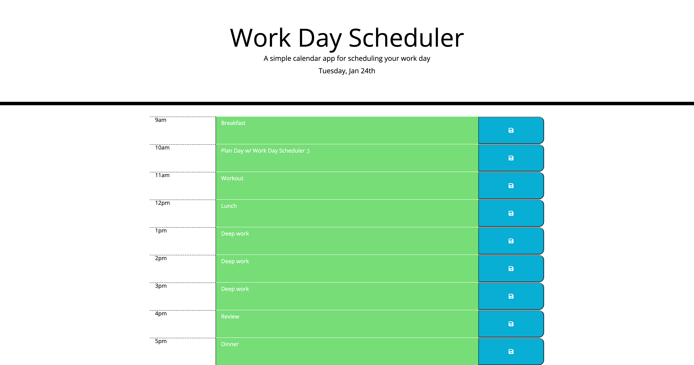

# { Work Day Scheduler }

## Description

Work Day Scheduler is a simple calendar application that allows users to save events for each hour or the work day. This app will run in the browser and features dynamically updated HTML and CSS, powered by jQuery.

## Table of Contents

- [Installation](#installation)
- [Features](#features)
- [Usage](#usage)
- [License](#license)
- [Credits](#credits)
- [Repository](#repository)
- [Deployment](#deployment)

## Installation

No installation necessary! This web app runs on most modern browsers.
 
Click the link to the deployment below to open the web application.

## Features

This app will run in the browser and features dynamically updated HTML and CSS, powered by jQuery.

## Usage

## License

Please refer to license in Repo.

## Credits

[jQuery](https://api.jquery.com)
 
[Traversing](https://api.jquery.com/category/traversing/)
 
[Events](https://api.jquery.com/category/events/)
 
[Bootstrap 5](https://getbootstrap.com)
 
[jQuery UI](https://jqueryui.com/demos/)
 
[Day.js](https://day.js.org)

## Repository

## Deployment
